<div align="center">

# Clothing Store

**Многостраничный адаптивный сайт интернет-магазина одежды**

Статическая вёрстка без использования фреймворков — чистый HTML5, SCSS и минимальный JavaScript.


</div>

---

## Страницы

### Главная

Hero-промо, категории товаров (Women, Men, Kids, Accessories), сетка Featured Items с hover-эффектами, секция преимуществ, отзывы, подписка на рассылку.

<p align="center">
  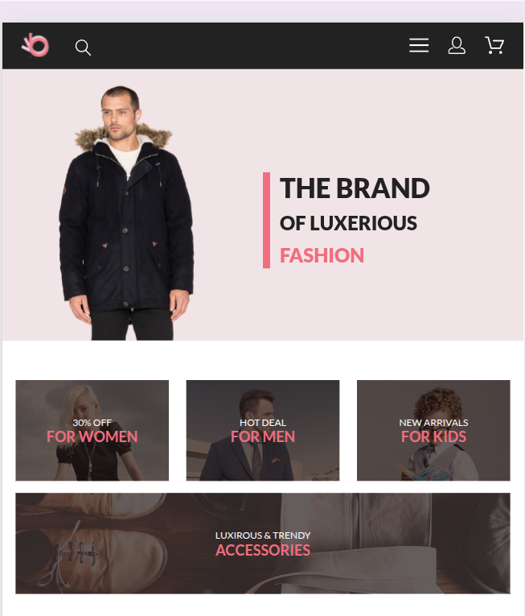
  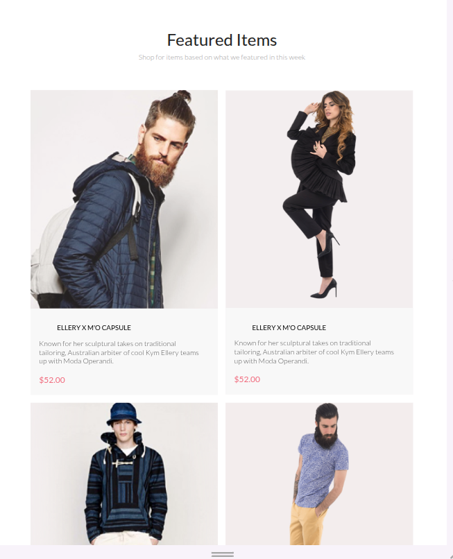
</p>
<p align="center">
  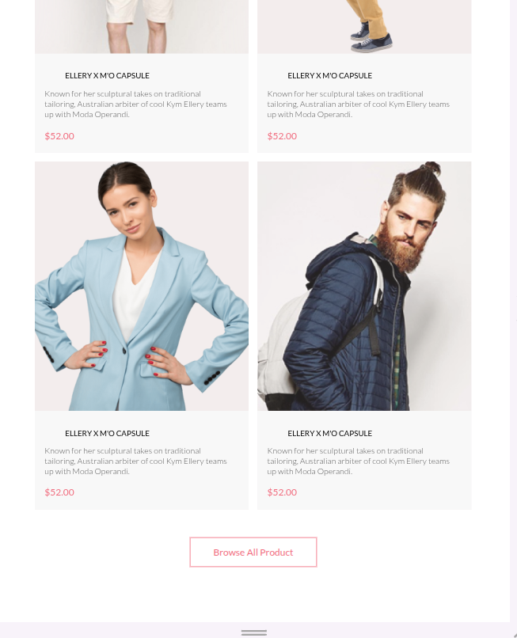
  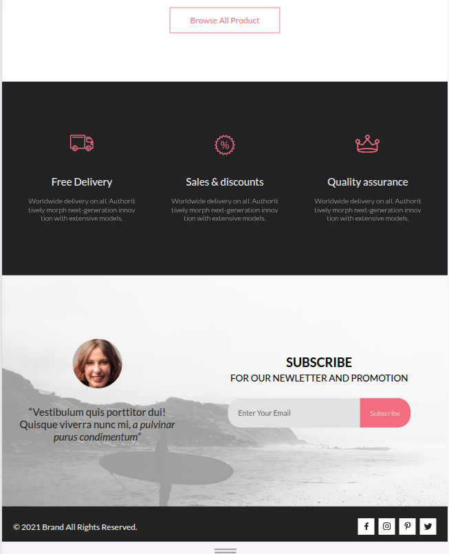
</p>

### Каталог

Хлебные крошки, раскрывающиеся фильтры (категория, бренд, дизайнер), сетка товаров, пагинация.

<p align="center">
  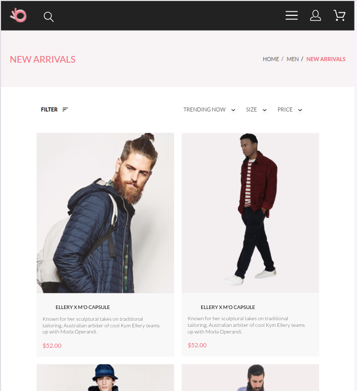
  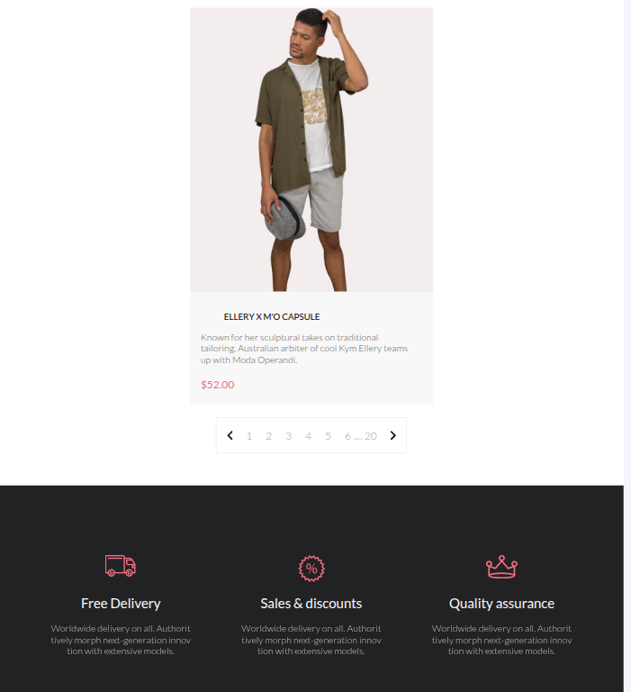
</p>

### Товар

Детальная страница продукта: галерея изображений, выбор цвета/размера, кнопка добавления в корзину.

<p align="center">
  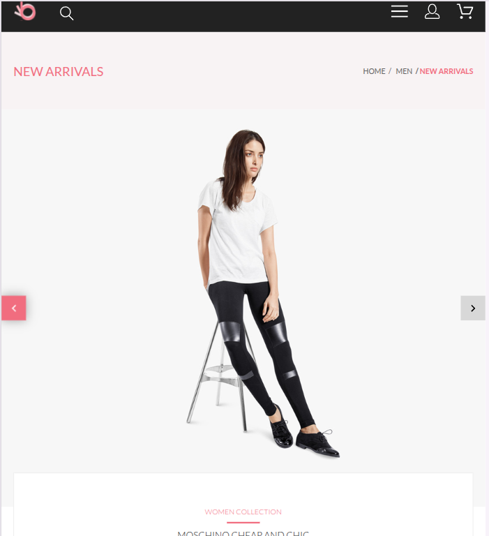
  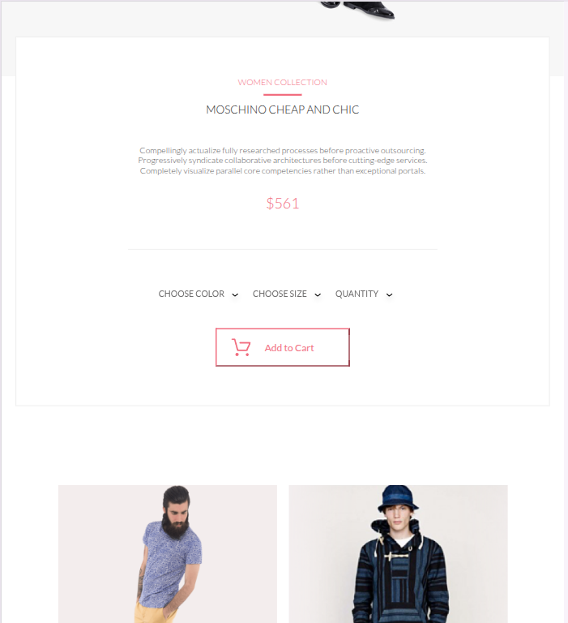
</p>

### Корзина

Список товаров с изображениями, количеством и ценой, итоговая сумма.

<p align="center">
  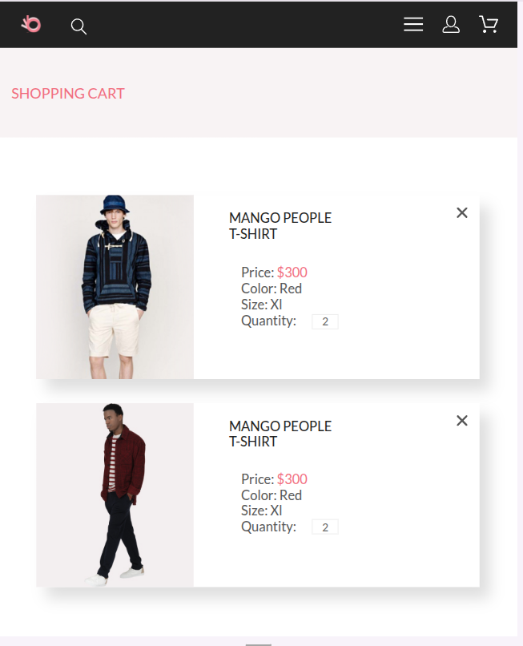
  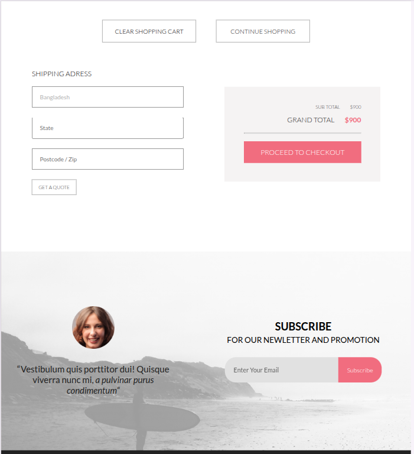
</p>

### Регистрация

Форма регистрации и входа в аккаунт.

<p align="center">
  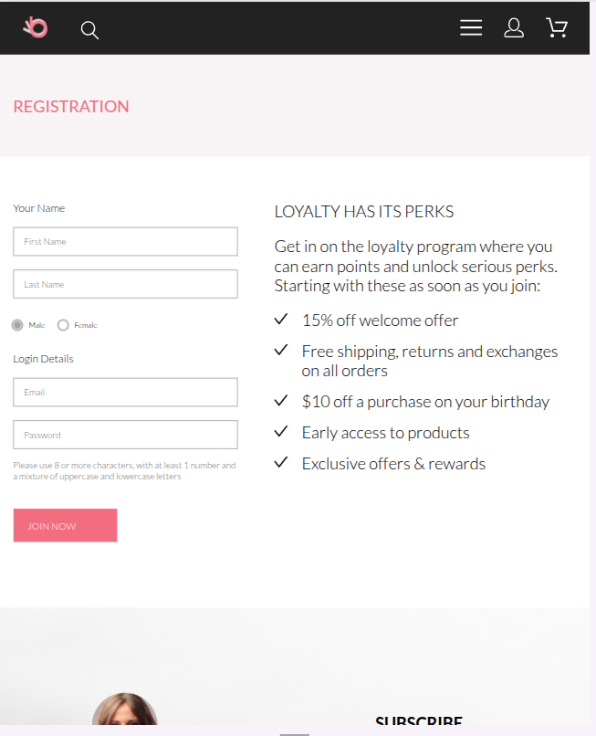
</p>

---

## Технологии

| Область | Технология |
|---------|-----------|
| Разметка | HTML5, семантические теги |
| Стили | SCSS → CSS (переменные, миксины, единый файл ~2450 строк) |
| Шрифты | [Google Fonts — Lato](https://fonts.google.com/specimen/Lato) (300, 400, 700, 900) |
| Иконки | [Font Awesome](https://fontawesome.com/) (CDN kit), inline SVG |
| JavaScript | Inline-скрипт на каждой странице (toggle бургер-меню) |
| Графика | SVG-иконки, PNG/JPG-изображения товаров и категорий |

## Структура проекта

```
clothing_store/
├── index.html              # Главная страница
├── catalog.html            # Каталог товаров
├── product.html            # Страница товара
├── cart.html               # Корзина
├── registration.html       # Регистрация / вход
├── style/
│   ├── style.scss          # Исходный SCSS (переменные, миксины, компоненты, media queries)
│   ├── style.css           # Скомпилированный CSS (~3785 строк)
│   └── style.css.map       # Source map для отладки
├── images/                 # Изображения и иконки
│   ├── item_1.png … item_12.png   # Карточки товаров
│   ├── for_women.jpg, for_men.jpg, for_kids.jpg, accessories.jpg
│   ├── product-img.png     # Изображение на странице товара
│   ├── *.svg               # SVG-иконки (корзина, поиск, соцсети, фильтры)
│   └── ...
├── screenshots/            # Скриншоты для README
└── README.md
```

## Адаптивность

Сайт полностью адаптивен — desktop-first подход, **11 брейкпоинтов** от 1190px до 410px:

| Ширина | Назначение |
|--------|-----------|
| 1190px | Уменьшение контейнера |
| 1170px | Адаптация фильтров каталога |
| 967px | Перестройка промо-секции |
| 870px | Перекомпоновка промо-блоков |
| **768px** | **Планшет** — перестройка каталога, навигации |
| 695px | Адаптация секции преимуществ |
| 680px | Промо в одну колонку |
| 625px | Упрощение промо-элементов |
| 605px | Сужение контейнера и сетки |
| 445px | Адаптация мелких элементов |
| **410px** | **Мобильная** версия |

## Основные компоненты UI

- **Header** — логотип, кнопка поиска, бургер-меню, иконки профиля и корзины
- **Боковое меню** — выдвижная навигация с категориями (MAN / WOMAN / KIDS) и подкатегориями
- **Карточки товаров** — изображение, название, описание, цена, кнопка «Add to Cart» с hover-overlay
- **Фильтры** — раскрывающиеся блоки (`<details>`) для категории, бренда, дизайнера
- **Секция преимуществ** — Free Delivery, Sales & Discounts, Quality Assurance
- **Footer** — копирайт, иконки соцсетей (Facebook, Instagram, Pinterest, Twitter)

## SCSS-архитектура

Стили организованы в одном файле `style/style.scss`:

- **Переменные** — цвета (`$main-color: #f16d7f`), размеры шрифтов, тайминги анимаций
- **Миксины** — типографика (`@mixin font-14-400`, `@mixin font-44-900` и др.), flexbox-утилиты
- **Компонентные блоки** — стили сгруппированы по секциям (header, promo, categories, catalog, benefits, feedback, footer)
- **Media queries** — собраны в конце файла, от большего к меньшему экрану (desktop-first)

## Запуск

Проект не требует сборки и зависимостей. Для локального просмотра:

1. Клонировать репозиторий:

```bash
git clone https://github.com/Sharymka/clothing_store.git
cd clothing_store
```

2. Открыть `index.html` в браузере или использовать Live Server:

```bash
# VS Code: установить расширение Live Server, нажать Go Live
# Или через npx:
npx serve .
```


## История разработки

Проект развивался поэтапно через Pull Requests:

| PR | Этап | Что сделано |
|----|------|-------------|
| #1 | Разметка | Главная страница — структура и базовые стили |
| #2 | Разметка | Страница каталога с фильтрами и пагинацией |
| #3 | Эксперимент | Попытка использовать Bootstrap (позднее удалён) |
| #4 | SCSS | Страница товара, переход на препроцессор — переменные, миксины |
| #5 | Новые страницы | Корзина и регистрация, анимации и переходы |
| #6 | Адаптивность | Responsive-вёрстка главной и каталога |
| #7 | Адаптивность | Responsive-вёрстка корзины и товара |
| #8 | Финализация | Адаптивность регистрации, доработка всех страниц |

